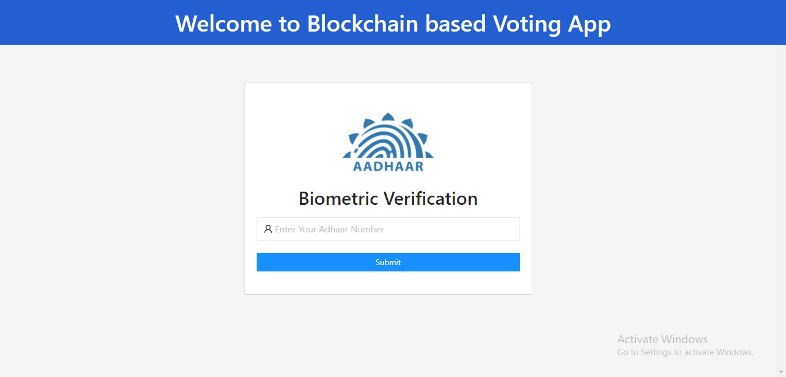
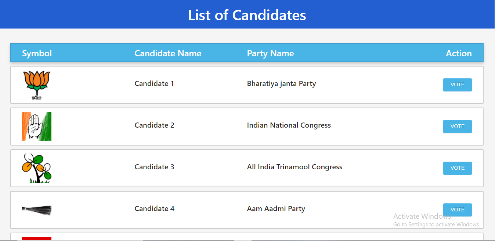
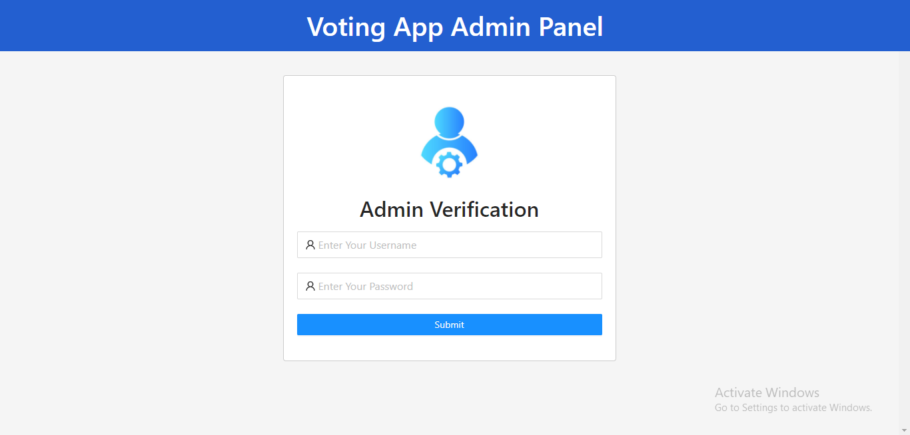
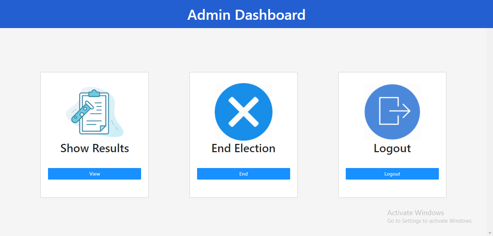
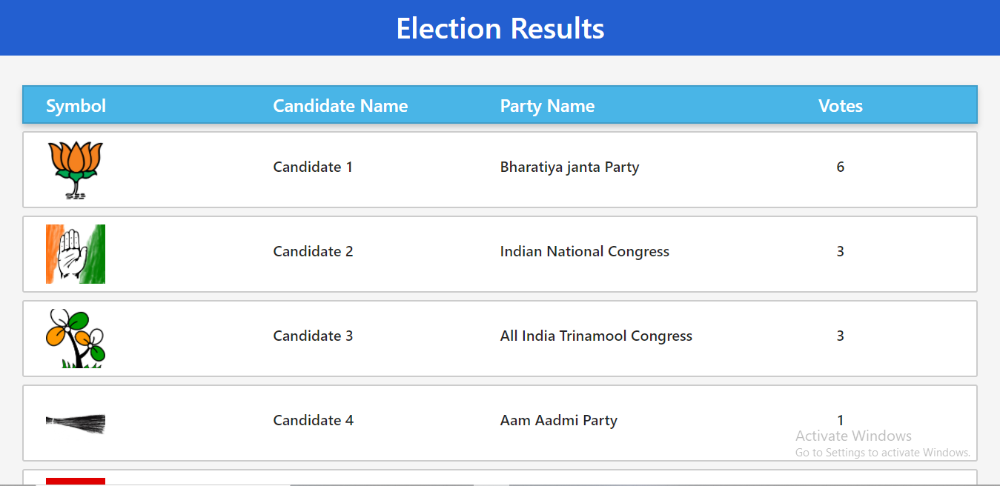

# Voting System using Smart contract
> This is a decentralized voting system based on Blockchain technology, which is distributed over a network using smart contracts.  
> Video Explanation [_here_](https://youtu.be/AyliXUSLXj8). <!-- If you have the project hosted somewhere, include the link here. -->

## Table of Contents
* [General Info](#general-information)
* [Technologies Used](#technologies-used)
* [Features](#features)
* [Screenshots](#screenshots)
* [Room for Improvement](#room-for-improvement)
* [Acknowledgements](#acknowledgements)

## General Information
- This is a decentralized voting system based on Blockchain technology.
- Voting has always been a hectic process. Earlier all the work was done manually which takes a lot of time. Electronic  voting systems are quite efficient which resolve the timing issue effortlessly, but the problem is that the systems can be hacked, and votes can be tempered, the reason  being  the  centralized  system. 
-  Decentralized  systems  are  more  desirable  then  centralized  systems  as popularized due to distributed ledger technologies such as Smart Contract. Which makes it quite secure.

## Technologies Used
- Solidity for writing smart contracts
- ReactJS for frontend of the application
- Flask for backend of the application
- Ganache for deploying contract and providing keys.

## Features
List the ready features here:
- Voters panel which allows voters to enter the system and caste their vote.
- Admin Panel for ending the voting process and to see the results of the election.

## Screenshots

<!-- If you have screenshots you'd like to share, include them here. -->

## Room for improvement:
- The voters and admin verification needs to be upgraded to Biomatric means.
- Candidates listing based on users location using Aadhar API.

## Acknowledgements
- This project was inspired by need of decentralized systems to insure security and increase transparency.
- Many thanks to Mr. Kaushik Das Sir, Department of Computer Science and Engineering, Kalyani Government Engineering College.

